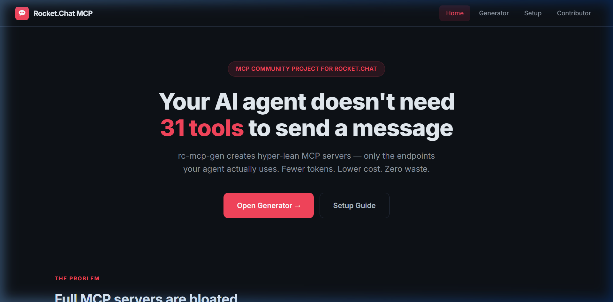
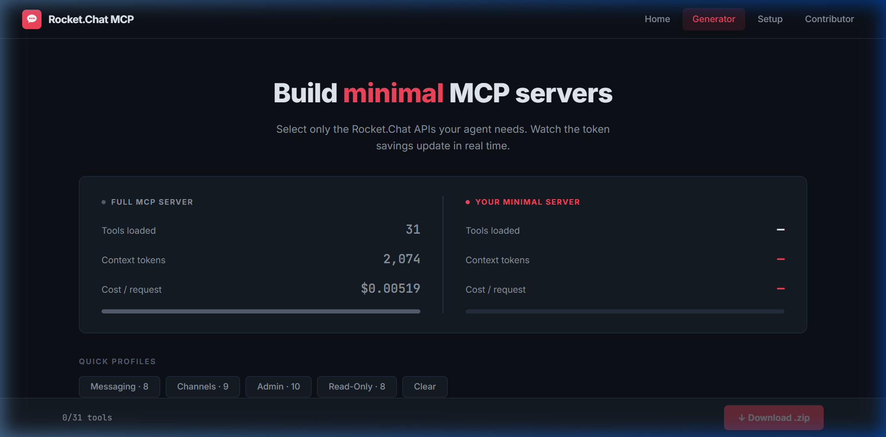
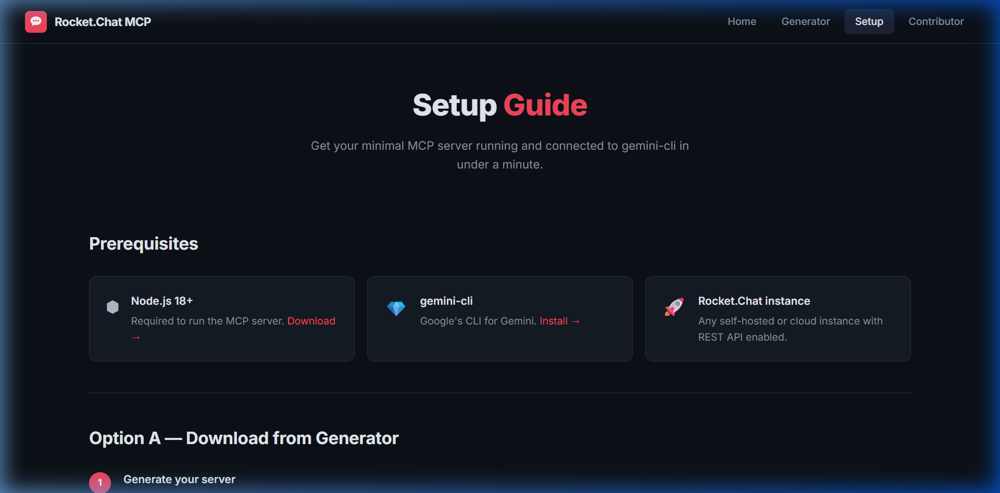
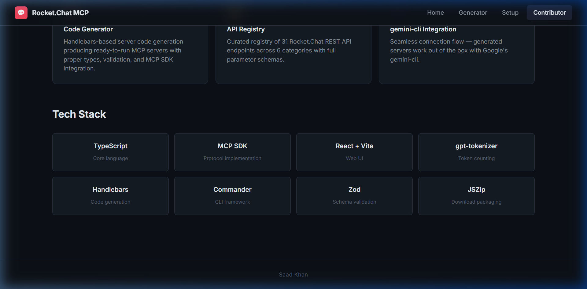

<p align="center">
  
</p>

<h1 align="center">rc-mcp-gen</h1>
<p align="center">
  <strong>Minimal MCP Server Generator for Rocket.Chat</strong>
</p>
<p align="center">
  Generate hyper-lean MCP servers with only the endpoints your AI agent actually needs.<br/>
  Fewer tokens. Lower cost. Zero waste.
</p>

<p align="center">
  <a href="https://rc-mcp-gen.vercel.app">Live Demo</a> · 
  <a href="https://rc-mcp-gen.vercel.app/generator">Try Generator</a> · 
  <a href="https://rc-mcp-gen.vercel.app/setup">Setup Guide</a>
</p>

---

## The Problem

Full MCP servers load **every tool definition** into the LLM context — even the ones your agent never calls. For Rocket.Chat, that means:

- **31 tools** injected into every request
- **2,074 tokens** burned on tool descriptions alone
- Higher latency, more hallucinations, and wasted cost at scale

## The Solution

`rc-mcp-gen` lets you select only the APIs you need and generates a minimal, ready-to-run MCP server.

| Metric | Full Server | Minimal (Messaging) | Savings |
|--------|-------------|---------------------|---------|
| Tools | 31 | 8 | 74% fewer |
| Tokens | 2,074 | 603 | **71% lighter** |
| Cost/req | $0.00519 | $0.00151 | 71% cheaper |

## Features

### 🎨 Interactive Web UI

Select APIs, watch token savings update in real time, download your server as a `.zip`.

<p align="center">
  
</p>

### ⚡ CLI Tool

```bash
# List all available endpoints
npx ts-node src/index.ts list

# Generate a minimal server
npx ts-node src/index.ts generate --apis login channels.list chat.sendMessage

# Run token benchmarks
npx ts-node src/index.ts benchmark --profile messaging
```

### 📊 Token Benchmark Engine

Accurate token measurement using `gpt-tokenizer` — real data, not estimates.

### 🔌 gemini-cli Integration

Generated servers work out of the box with Google's gemini-cli.

## Quick Start

### Option A — Web Generator

1. Go to [rc-mcp-gen.vercel.app/generator](https://rc-mcp-gen.vercel.app/generator)
2. Select the APIs your agent needs
3. Click **Download .zip**
4. Unzip, `npm install`, connect to gemini-cli

### Option B — CLI

```bash
git clone https://github.com/MALIKSAAD-dev/rc-mcp-gen.git
cd rc-mcp-gen && npm install

# Generate a server with only messaging APIs
npx ts-node src/index.ts generate --apis login me channels.list chat.sendMessage
```

### Connect to gemini-cli

Add to `~/.gemini/settings.json`:

```json
{
  "mcpServers": {
    "rocketchat": {
      "command": "npx",
      "args": ["ts-node", "src/server.ts"],
      "env": {
        "ROCKETCHAT_URL": "https://your-instance.rocket.chat"
      }
    }
  }
}
```

Then:

```
gemini > "Send 'Hello' to #general on Rocket.Chat"
```

## API Coverage

31 endpoints across 6 categories:

| Category | Endpoints | Example |
|----------|-----------|---------|
| 🔐 Auth | 3 | `login`, `logout`, `me` |
| 📢 Channels | 7 | `channels.list`, `channels.create`, `channels.history` |
| 💬 Chat | 6 | `chat.sendMessage`, `chat.postMessage`, `chat.search` |
| 👤 Users | 5 | `users.info`, `users.list`, `users.create` |
| 🔒 Groups | 5 | `groups.list`, `groups.create`, `groups.history` |
| ⚙️ System | 5 | `info`, `statistics`, `settings.public` |

## Tech Stack

| Layer | Technology |
|-------|------------|
| Core | TypeScript |
| Protocol | MCP SDK |
| Web UI | React + Vite |
| Token Counting | gpt-tokenizer |
| Code Generation | Handlebars |
| CLI | Commander |
| Validation | Zod |
| Download | JSZip |

## Project Structure

```
rc-mcp-gen/
├── src/
│   ├── index.ts              # CLI entry point
│   ├── registry/endpoints.ts # API endpoint registry
│   ├── generator/            # Server code generator
│   ├── benchmark/            # Token benchmark engine
│   └── templates/            # Handlebars templates
├── web/
│   ├── src/
│   │   ├── App.tsx           # Router
│   │   ├── Layout.tsx        # Shared nav + footer
│   │   ├── data.ts           # Endpoint data + token counts
│   │   ├── generate.ts       # .zip generator
│   │   └── pages/
│   │       ├── Landing.tsx    # Problem/solution narrative
│   │       ├── Generator.tsx  # Live token comparison
│   │       ├── Setup.tsx      # Installation guide
│   │       └── Contributor.tsx# About the developer
│   └── index.html
└── docs/screenshots/
```

## Screenshots

<details>
<summary>Setup Guide</summary>

</details>

<details>
<summary>Contributor</summary>

</details>

---

<p align="center">
  Built by <a href="https://maliksaad.bio.link"><strong>M. Saad Khan</strong></a> — MCP Community Project for Rocket.Chat
</p>
